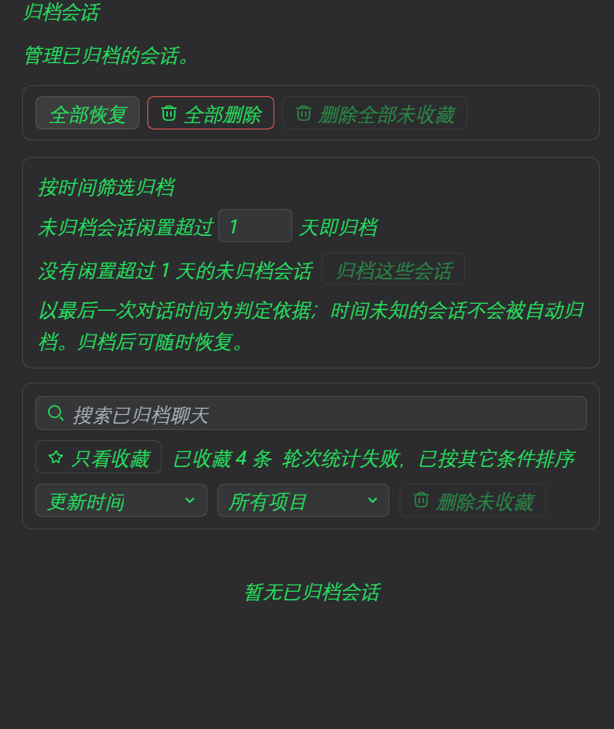

# dsh-archive-manager 增强补丁（收藏置顶 · 排序 · 一键归档 · 一键删除）

> 给 DSH Desktop 的归档插件 `@michengai/dsh-archive-manager` 加功能：
> **会话收藏与置顶**、**侧边栏按时间排序（升/降序）**、**按时间一键归档**、**一键删除已归档（带加速与进度条）**。
>
> 不改上游 npm 包，用**补丁工程**在本地增强；升级/重装后一条命令即可重放。

---

## 📸 效果预览

### 侧边栏：收藏星标 + 置顶图钉 + 三态时间排序


> 会话行左侧：📌 置顶图钉 + ⭐ 收藏星标**并列显示**；
> 工作区「…」菜单：**按时间排序（关闭 / 降序 / 升序）** + 自动归档闲置会话 + 归档全部聊天。

### 归档设置页：按时间筛选归档 + 收藏管理



> 按闲置天数一键归档（含进度条）、只看收藏、已收藏计数、全部恢复 / 全部删除 / 删除全部未收藏。

---

## ✨ 功能总览

### 1. 会话收藏（星标）

| 位置 | 功能 |
|---|---|
| **侧边栏会话行** | 收藏的会话在标题左侧显示**金色实心星**（与置顶图钉并列） |
| **归档会话页** | 每条聊天左侧星标按钮，点击收藏 / 取消（任一处操作，另一处实时同步） |
| **只看收藏** | 工具栏开关，一键过滤出已收藏项，旁显「已收藏 n 条」 |
| **收藏置顶** | 列表内已收藏项自动排在同组最前 |
| **删除全部未收藏** | 一键删除「全部归档中未收藏的聊天」，已收藏一律保留 |
| **删除当前筛选未收藏** | 只作用于当前项目筛选 / 搜索结果中的未收藏项 |
| **收藏清理** | 单条或批量删除成功后，自动从收藏集合移除对应 id |

状态持久化：`localStorage` → `dsham.favoriteArchivedSessions.v1`

### 2. 会话置顶

- 侧边栏「…」菜单可**置顶 / 取消置顶**
- 置顶项显示**图钉标记**，整体排在未置顶之前
- 与排序共存时：**置顶整体优先，置顶组内仍按时间排**
- 状态持久化：`dsham.pinnedSessions.v1`

### 3. 侧边栏按时间排序（三态）

工作区「…」菜单里三选一（当前项打勾）：

| 选项 | 效果 |
|---|---|
| **按时间排序：关闭** | 保持原有顺序（置顶前置，其余不动） |
| **按时间排序：降序（新→旧）** | 最新会话在前 |
| **按时间排序：升序（旧→新）** | 最旧会话在前 |

排序规则：
```
最终顺序 = [ 置顶组（按时间排）] + [ 未置顶组（按时间排）]
```
- 无时间戳的会话固定排在最后
- 切换立即生效（已修正 useMemo 依赖）

状态持久化：`dsham.sidebarSortByTime.v2`（自动兼容 v1 的布尔值）

### 4. 按时间一键归档（按闲置天数）

- 设置页「归档会话」内新增卡片：**按时间筛选归档**
- 可设**闲置天数阈值**，实时显示「当前有 N 个会话闲置超过 X 天」
- 点「归档这些会话」→ **逐条归档 + 进度条**
- **撤回上一步**：一键恢复刚归档的会话
- **判定口径**：以**最后一次对话时间**为准；时间未知的会话不会被自动归档
- **范围口径**：只统计**侧边栏可见的未归档会话**（各工作区 `sessionIds` 并集），不含子代理残留

### 5. 一键删除已归档（加速 + 进度条）

- 支持**删除全部 / 按工作区 / 按选中项**
- **速度优化**：修复上游 O(n²) 全盘扫描（详见下文「性能修复」）
- **进度条**：显示 `删除进度 20 / 20（100%）· 1.4s`，完成后停留 10 秒
- **安全保护**：每步带超时（默认 5 秒/步），不会永久卡死主进程
- **降级链**：安全删除 → 快速删除 → 分批删除 → 原版删除（保证一定能删）
- **同步日志**：每步写入 `~/.dsh/archive-manager-delete.log`，卡死也能定位

### 6. 侧边栏「…」菜单其他增强

- **收藏 / 取消收藏**
- **复制会话 ID**
- **复制会话文件路径**（转录工件绝对路径，如 `...\<sessionId>.jsonl`）
- **复制 ID + 文件路径**（一键复制两行）

复制结果短暂显示在会话行的时间位置。

---

## 🔧 性能修复（本次核心）

### 问题：批量删除"卡死"

上游 `deleteSessionCore` 逐条删除时，`deleteDescendants` 与 `sessionKnown` **每个会话都全盘扫描一次**：

```js
// 上游 dsh-workspace 基类
async listStoredHeaders() {
  return (await this.ctx.sessionPersistence.list()).map((s) => s.header);
}
// sessionPersistence.list 内部对每个转录文件做一次 stat
for (const artifact of await this.listArtifacts(signal)) {
  const identity = await stat(artifact.path, { bigint: true });   // ← 每个文件一次
}
```

**800+ 个会话文件 × 380 次调用 = 30 万次 stat** → 240ms/会话 → 总计 **90 秒+**（表现为"卡死"）。

### 修复

| 修复 | 做法 |
|---|---|
| **子会话索引** | 批量入口 `buildDescendantsIndex()` **只扫一次**，循环内查内存表 |
| **存在性缓存** | `knownSessionIds` Set + 批量预热，`sessionKnown` 命中即返回 |
| **并发删文件** | `Promise.allSettled` 并发（默认 8-12）删转录目录 |
| **索引合并写盘** | 归档集合 + 工作区账户各只写**一次**（原来每条会话写 2 次） |

**效果**：90 秒+ → **几秒**。

> 所有修复**保留原分支逻辑**（墓碑检查、级联删除、安全检查），只优化扫描路径。

---

## 📦 安装与使用

### 前置

- DSH Desktop 已安装
- 目标插件已装：`@michengai/dsh-archive-manager`（建议 0.1.40）
  ```powershell
  # 若未安装
  dsh plugin add @michengai/dsh-archive-manager
  ```

### 应用补丁

```powershell
cd <你的插件目录>\dsh-archive-manager-favorites-patch

node apply-all.mjs            # 一键：恢复基线 → 顺序重放全部补丁 → 跑门禁
node apply-all.mjs --dry-run  # 只校验锚点，不写盘
```

`apply-all.mjs` 会：
1. 从 `~/.dsh/backups/` 恢复基线文件
2. 按顺序重放各批补丁
3. **门禁 1**：remote 声明结构校验（防 DSH 起不来）
4. **门禁 2**：客户端 / 宿主端一致性
5. 任一失败 → **自动回滚** + 非 0 退出

### 生效

**完全退出 DSH 再启动**（不是刷新页面），然后 `Ctrl+Shift+R` 硬刷新。

### 回滚

```powershell
# 方式一：恢复基线
copy ~/.dsh/backups/archive-manager-favorites-<时间戳>/client.js.orig  <插件目录>/lib/client.js
copy ~/.dsh/backups/archive-manager-favorites-<时间戳>/workspace.js.orig <插件目录>/lib/workspace.js

# 方式二：直接在 DSH 里卸载插件后重装
dsh plugin remove @michengai/dsh-archive-manager
dsh plugin add @michengai/dsh-archive-manager
```

---

## 🔒 隐私说明

本仓库**不含**任何：

- API key / token / 私钥 / 密码
- 本机用户名或 `C:\Users\<用户名>` 路径
- 真实内网 IP（示例用 RFC 5737 文档保留地址 `203.0.113.x`）
- 邮箱地址

所有本机路径均通过 `homedir()` / 环境变量**动态获取**。

`@michengai/dsh-archive-manager` 是**上游 npm 公开包名**，补丁需引用它定位目标目录，属必要信息。

---

## 📁 项目结构

```
dsh-archive-manager-favorites-patch/
├── apply-all.mjs                      # ★ 一键重放（含门禁与回滚）
├── apply-idle-auto-archive-patch.mjs  # ★ 主补丁（C1-C19 + W1-W14）
├── apply-patch.mjs                    # 早期补丁：收藏 / 复制
├── apply-pin-patch.mjs                # 早期补丁：置顶
├── apply-delete-progress-patch.mjs    # 早期补丁：删除进度
├── apply-digest*.mjs                  # 早期补丁：对话摘要
├── apply-layout-patch.mjs             # 早期补丁：布局
├── apply-turns-patch.mjs              # 早期补丁：按轮次排序
├── apply-hide-upstream-links-patch.mjs# 早期补丁：隐藏上游链接
├── snippets/                          # ★ host 侧大段代码（避开模板转义）
│   ├── host-safe-delete.js            #   安全删除（分步超时 + 日志）
│   ├── host-fast-delete.js            #   快速删除（并发 + 索引合并）
│   └── host-direct-delete.js          #   直删（自行解析目录 + rm）
├── verify-remote-descriptors.mjs      # ★ 门禁：remote 声明结构校验
├── verify-release.mjs                 # 发布前校验（含隐私扫描）
├── probe-*.mjs                        # 各类探针 / 回归测试
├── make-release.mjs                   # 发布打包
└── README.md                          # 本文件
```

---

## 🧩 补丁批次说明

| 批次 | 内容 |
|---|---|
| `apply-patch.mjs` | 收藏星标、只看收藏、复制 ID/路径、宿主会话路径路由 |
| `apply-pin-patch.mjs` | 会话置顶（侧边栏图钉 + 置顶优先） |
| `apply-turns-patch.mjs` | 按轮次排序 |
| `apply-digest*.mjs` | 行内对话摘要按钮 + 展开详情 + 视图 |
| `apply-layout-patch.mjs` | 布局调整 |
| `apply-hide-upstream-links-patch.mjs` | 隐藏上游链接 |
| `apply-delete-progress-patch.mjs` | 批量删除提速 + 删除进度显示（早期版） |
| **`apply-idle-auto-archive-patch.mjs`** | **主补丁**：按时间归档、进度条、排序三态、批量删除加速、侧边栏星标 |

---

## ⚠️ 已知限制

1. **需要与上游版本匹配**：补丁基于 `@michengai/dsh-archive-manager@0.1.40` 的文件内容做锚点替换。上游大版本更新后锚点可能失配 → `apply-all.mjs` 会自动中止并回滚，此时需按新版调整锚点。
2. **自动归档定时器尚未接入**：工作区菜单里的「自动归档闲置会话」开关已就绪（默认关），但定时执行逻辑待实现。
3. **删除性能依赖修复生效**：若宿主端补丁未生效（可看日志有无 `archive-manager(fast)` 输出），会回退到原版慢速删除。

---

## 📄 License

MIT

## 🙏 致谢

- 上游插件：[`@michengai/dsh-archive-manager`](https://www.npmjs.com/package/@michengai/dsh-archive-manager)（作者 MichengAI）
- 本仓库仅为**本地增强补丁**，不含上游源码
