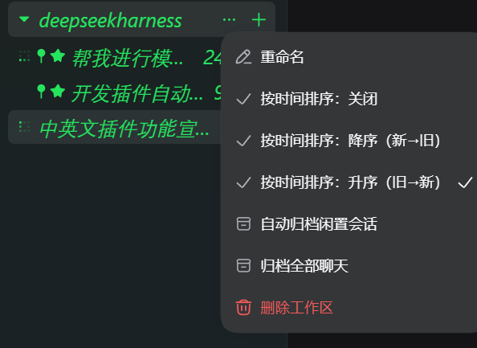

## Provenance & credits (please read)

**This package is built and maintained by [loyalchiiina](https://github.com/loyalchiiina)** — the favorites / pin / turns / auto-archive enhancements, the release packaging and the current documentation are all authored here.

| Item | Detail |
|---|---|
| Package author / maintainer | **[loyalchiiina](https://github.com/loyalchiiina)** — the enhanced build published in this repository |
| Baseline upstream | [MichengAI/dsh-archive-manager](https://github.com/MichengAI/dsh-archive-manager) — the "Archived sessions" plugin by **MichengAI**; all baseline capabilities and the original design come from his project (**thank you!**) |
| Baseline version | **v0.1.40** (that release's code forms the base layer, patched on top) |
| License | Apache License 2.0 (upstream `LICENSE` retained verbatim; modifications documented in `NOTICE`) |

Copyright of the pre-existing baseline code remains with MichengAI as required by Apache-2.0; everything documented under "what this adds" below is authored and maintained by loyalchiiina.

### What this fork adds

1. **Favorites for archived sessions** — inline star buttons plus sidebar menu entries, a "favorites only" filter, favorited-first ordering inside each group, and automatic pruning when chats are deleted.
2. **One-click delete of unfavorited chats** — two scopes: all archived chats outside favorites, or only those in the current filtered results, sharing the existing confirmation dialog.
3. **Pin sessions** — pin from the sidebar session menu; pinned rows always sort first within their group without touching the host's manual ordering data.
4. **Sort by conversation turns** — a new "Turns" sort plus a per-row turn badge. Counts are derived locally from session transcripts with the same semantics as official `sessionStats`: **no model calls, zero token cost**, cached per persisted revision.
5. **Copy session ID / transcript path** — three clipboard entries in the sidebar menu; paths are resolved through the official persistence backend via a loopback-only read route.
6. **Archive settings layout rework** — rows wrap onto two lines so titles are no longer squeezed; toolbar and batch-action header become grouped cards.
7. **Trimmed UI** — this fork hides the "GitHub" / "Issues" header links and the built-in "check for updates" button (a pure UI preference, no functional impact).

> ⚠️ This package **cannot coexist** with upstream `dsh-archive-manager-plus`: both provide the same host services (workspace / projection cache / ui-workspace). Install one of them.

---

<div align="center">

  # DSH Archive Manager

  **Safely manage archived sessions in DeepSeek Harness**

  [简体中文](README.zh-CN.md) · [Changelog](CHANGELOG.md) · [Apache-2.0](LICENSE)

  [](LICENSE)
  [](https://www.npmjs.com/package/dsh-archive-manager-plus)
  [](https://www.npmjs.com/package/dsh-archive-manager-plus)
  [](https://github.com/MichengAI/dsh-archive-manager)
</div>

> DSH Archive Manager is a community-maintained DeepSeek Harness (DSH) plugin, not an official DeepSeek AI product.

## What you can do

Put inactive conversations away and find them again when needed, keeping everyday task lists tidy.

- **Archive conversations**: put away one chat or all unarchived chats in a workspace.
- **Find past work**: search titles, filter by project, and sort by time or title.
- **Restore tasks**: restore one chat, selected chats, a project group, or all archives.
- **Clean up records**: permanently delete unwanted archived conversations after confirmation.

## Screenshots

Archive, pin, and sort chats right from the sidebar session menu:



Find, restore, and clean up chats in **Settings → Archived sessions**:


## Prerequisites

- A working [DeepSeek Harness](https://github.com/deepseek-ai/deepseek-harness) Web installation with `dsh` available in your terminal.
- Supported DSH versions: `0.1.0-rc.8`, `0.1.1-rc.2`, `0.1.2-rc.1`, `0.1.5-rc.1`, and `0.1.5-rc.2`. Other versions are not currently supported.
- Node.js matching `^22.19.0 || >=24.0.0`. Source installation also requires pnpm.

## Installation

Examples use the `web` profile. Replace it with the profile you actually use.

### Ask an agent to install it

Send this prompt to an agent that can run terminal commands on your computer:

```text
Install the latest dsh-archive-manager-plus into my local DSH web profile using the official npm registry. Check the plugin configuration afterward, then explain how to reload DSH and open archived session management.
```

### Install manually

Run in PowerShell:

```powershell
[Console]::OutputEncoding = [System.Text.Encoding]::UTF8
$OutputEncoding = [System.Text.Encoding]::UTF8

dsh plugin --profile web add dsh-archive-manager-plus@latest --registry=https://registry.npmjs.org/
```

Restart DSH Web, then hard-refresh your browser with `Ctrl+Shift+R`. Open **Settings → Archived sessions** to get started.

## Usage

| Goal | Action |
| --- | --- |
| Archive one chat | Open its sidebar menu and choose **Archive session** |
| Archive a workspace | Open the workspace menu and choose the option to archive its chats |
| Find an archive | Open **Settings → Archived sessions**, then search titles or filter by project |
| Change the order | Sort by update time, creation time, or title |
| Restore one chat | Click **Unarchive** beside the session |
| Restore or delete in bulk | Select chats and use the bulk actions, or use the project menu or page-wide actions |

Selections persist when filters change. Check the hidden selection count before applying bulk actions, or clear your selection first.

### View and continue archived conversations

Available starting with `0.1.40`:

- **View conversation**: open the native DSH session to view messages, attachments, and tool details. Continue chatting while keeping the session archived.
- **Restore and open**: unarchive the session and open it to resume work.

## Updates

Click **Check for updates** in the archive management page header. DSH CLI or Desktop environments with automatic update support can update directly; other environments provide a manual command for the current profile. You can also rerun the installation command above.

## FAQ

### Why is the entry missing after installation?

Restart DSH Web and hard-refresh your browser. Make sure you installed into the profile you are using. If the entry is still missing, run:

```powershell
[Console]::OutputEncoding = [System.Text.Encoding]::UTF8
$OutputEncoding = [System.Text.Encoding]::UTF8

dsh --profile web --dump-config
```

The configuration should include `workspace-archive-manager` and `ui-workspace-archive-manager`. If you previously set the official `ui-workspace` to `disabled: true` in your profile's `cordis.patch.yml`, remove that disabling override and restart.

### How is archiving different from deletion?

Archiving puts a conversation away so you can restore it later. **Permanent deletion cannot be undone** and may also remove that session's attachments. It does not delete your project working directory. Deletion requires confirmation.

### Can I use it with Codex UI?

Yes. [Codex UI](https://github.com/MichengAI/dsh-codex-ui) keeps its sidebar appearance and interactions. Archive management remains available in **Settings → Archived sessions**.

For other problems, open an [issue](https://github.com/MichengAI/dsh-archive-manager/issues) with your DSH and plugin versions, reproduction steps, and error details.

## Install from source

<details>
<summary>Expand for development or testing unreleased changes</summary>

Run these commands in a directory of your choice. For local changes that have not been pushed, use the existing working copy.

```powershell
[Console]::OutputEncoding = [System.Text.Encoding]::UTF8
$OutputEncoding = [System.Text.Encoding]::UTF8

git clone https://github.com/MichengAI/dsh-archive-manager.git
Set-Location .\dsh-archive-manager
pnpm install --frozen-lockfile
pnpm build
dsh plugin --profile web add .
```

Restart DSH Web and hard-refresh your browser afterward. Edit [src](src), not the generated `lib` directory. Run `pnpm test` to validate changes or `pnpm verify` for the full checks.

</details>

## Related projects

[DSH Codex UI](https://github.com/MichengAI/dsh-codex-ui) provides project and conversation management. For a desktop workbench, see [DSH Codex Desktop](https://github.com/MichengAI/dsh-codex-desktop).

## License

Licensed under [Apache License 2.0](LICENSE).
